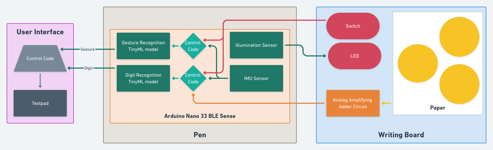

# DigitBoard
### Using motion-based Digit Recognition to create a fun project for the Tensorflow Microcontroller Challenge
 

## Demo
Check out a short fun video demonstration of the DigitBoard - 
 
https://youtu.be/d9JbB8Kmpzg
 
 

## Overview
I like to call this project of mine as 'DigitBoard' because of two reasons -  
1. It was designed to implement <b>digit</b> recognition using TinyML models
2. This idea essentially <b>digit</b>izes pen-and-paper writing, i.e. as you write something down on paper, you are automatically and simultaneously getting a digital version of your writing.
 
 

## Block Diagram

The DigitBoard works under two modes - Digit Recognition & Gesture Recognition. The modes can be changed using the switch.

In the Digit Recognition mode, the IMU sensor data is collected and used to predict which digit is being drawn, but only if the piezo-electric cells detect the pen writing on the board. This ensures that digit recognition is being done only if the pen is actually writing on the board and prevents random movements of the pen from causing problems.

In the Gesture Recognition mode, the IMU sensor data is collected and used to predict which gesture is being made. Each gesture is later mapped to a set of commands related to moving the cursor, choosing a font color and changing font size.

Meanwhile, the illumination sensor continuously monitors the lighting levels and automatically switches the LED on in case it gets very dark.
 
 

## Schematic

<image src='./Images/schematic.png'>
 
 

Electronic Components Used:  
1. Arduino Nano 33 BLE Sense (x1)
2. Piezo-electric cells (x3)
3. LM741 (x1)
4. LED (x1)
5. Switch (x1)
6. 1 Mega-ohm resistor (x5)
7. 10 Kilo-ohm resistor (x1)
8. 1 Kilo-ohm resistor (x5)
 
 

## Main Features

* <b>Digit Recognition</b>: The core idea of this project was to be able to identify digits being drawn by tracking the motion of the pen. The main assumption here was that whatever shape I draw on a piece of paper, I can expect my pen to move in a similar shape. Hence, I can approximate what is being drawn on the paper without actually seeing the drawing through cameras or other visual sensors. The motion of the pen is being tracked by the LSM9DS1 IMU sensor in-built on the Arduino Nano 33 BLE Sense.
* <b>Pressure-sensitive Board</b>: It is also important to ensure that we track the motion of the pen only when it is writing something. Otherwise any random movement of the pen can be interpreted as something being drawn. Hence, by attaching piezo-electric cells underneath the drawing surface, we ensure that digit recognition happens only when the piezoelectric cells detect the pen writing on the surface. The piezoelectric cells have been covered with a sealant like M-Seal to not only distribute the pressure among all cells but also make the drawing surface flat.
* <b>Dim Lighting Assistance</b>: An extremely simple idea that can help writers write even in pitch-black darkness. Surrounding light levels are continuously monitored and if lighting conditions get extremely dark, an LED attached over the board automatically lights up. The lighting level is being tracked by the APDS9960 gesture sensor (which can also measure ambience illumincation) in-built on the Arduino Nano 33 BLE Sense.
* <b>Gesture Commands</b>: In order to customize/format the text on the User Interface, gesture commands can be used. After switching the mode via a switch, the pen can be used to make simple gestures. Each gesture is then mapped to a particular command which then updates the display. The motion of the pen is being tracked by the same LSM9DS1 IMU sensor in-built on the Arduino Nano 33 BLE Sense.
 
 

## Prototype

<image src='./Images/side_view.jpg'>
<image src='./Images/front_view.jpg'>
<image src='./Images/top_view.jpg'>
 
 

## Drawbacks

Like most embedded projects, I did have to face some issues. I managed to solve most of them but I did settle for a less better alternative in some cases.

My prototype was able to recognize only 3 digits - 0, 1 & 2. Although not very functional, my main intention was to show that the idea can work. With more complex models, better training techniques & better memory management, I am sure all 10 digits from 0 to 9 can be identified with considerable accuracy.

The communication of the DigitBoard with the laptop can happen either wirelessly through BLE or through UART. Although I was able to send messages using BLE, I wasn't able to integrate it with the TinyML models due to shortage of memory. Most probably, it might have been caused by my inefficient coding and hence should be easily resolvable. Again, since my intention was to show that the idea can work, I eventually opted for serial communication.
 
 

# Thank You!